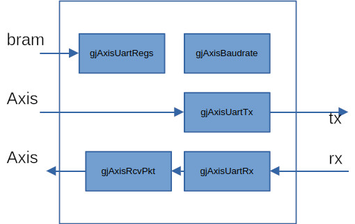

# gjAxisUart

<p align="center">
    <a href="./README.md">English</a> |
    中文
</p>

---

[](https://github.com/kejie1208/gjAxisUart/stargazers)
[](https://github.com/kejie1208/gjAxisUart/blob/main/LICENSE)

一个aixs接口的uart ip。

各模块基本完成，通过正常仿真，异常未仿。


<link rel="stylesheet" type="text/css" href="mkAutoNumber.css" />

## 特性

- 波特率可配置
- 奇偶校验
- 停止位1、2bit可配
- axis接口，cpu使用dma接收发送
- 接收自动组包配置
  - 配置最大帧长，提交一帧
  - 配置的超时时间，提交一帧

## 结构



### gjAxisUartRegs
寄存器模块，因寄存器数量少，将各个模块寄存器存放此模块。
记录接收信息。

### gjAxisUartBaudrate
波特率产生模块，根据软件配置的波特率，产生相应的时钟使能。

### gjAxisUartTx
发送模块，根据协议，产生tx波形。
### gjAxisUartRx
接收模块，根据协议，接收rx，产生axis信号，及错误信号。

### gjAxisUartRcvPkt
对接收的数据，根据设定的最大包数量，最大帧间隔，进行组包（产生接收tlast信号）。

## 接口描述


| 名称               | 输入输出 | 描述                              |
|:---------         |:-----     | :----------------------------------- |
| rst               | I  | 同步复位                           |
| clk               | I  | 时钟                               |
|___________________|___|___________________|
| tx_axis_tvalid    | I  | 发送axis  部份                    |
| tx_axis_tready    | O  |                                  |
| tx_axis_tdata[7:0]| I  |                                  |
| tx_axis_tlast     | I  | 用来控制帧间隔      |
|___________________|___|___________________|
| rx_axis_tvalid    | O  | 接收axis  部份                    |
| rx_axis_tdata[7:0]| O  |                                  |
| rx_axis_tlast     | O  |                                  |
|___________________|____|___________________|
| bram_en           | I  | bram配置部份                       |
| bram_addr[3:0]    | I  | 时序同 Xilinx Bram                 |
| bram_we[3:0]      | I  | 可接Xilinx Axi2bram ip               |
| bram_wdata[31:0]  | I  |                                  |
| bram_rdata[31:0]  | O  | rdata在en有效下一周期有效           |
|___________________|____|___________________|
| tx                | O  | uart发送                          |
| txEn              | O  | uart发送使能，高有效，用于485        |
| rx                | I  | uart接收                          |

无中断产生，中断请使用dma中断，或者：
  - 发送使用tx_axis_tvalid& tx_axis_tready & tx_axis_tlast
  - 接收使用rx_axis_tvalid& rx_axis_tready & rx_axis_tlast

## 寄存器列表

| 地址偏移| 名称 | 读写| 描述                              |
|:------ |:-----    |:--- | :----------------------------------- |
| 0x00   |ctrl |RW   |工作控制<br>`[0]工作使能`<br>`    1:工作`<br> `    0:休眠`<br>`[1] 复位状态标识，只读`<br>`    1:休眠中`<br> `    0:正常`             |
| 0x01   |mode      |RW   | 工作模式  <br> `    [0] 1:2个停止位`<br> `        0:1个停止位`<br>`    [1] 1:奇校验`<br>  `    [2] 1:偶校验`<br>`    [3] 1:使能帧间隔`<br> `        0:不使能帧间隔`                  |
| 0x02   | clkDivX16  [15:0] |RW | 16倍波特率的计数周期 ，clkDivX16=clkHz/16/波特率            |
| 0x04   | txByte_nop [15:0] |RW | 发送1字节等待bit数量                           |
| 0x06   | txFrame_nop[15:0] |RW | 发送1帧等待bit数量                           |
| 0x08   | maxRcvGap[15:0] |RW | 一帧中字节间最大间隔bit数量，也是一帧间隔的最小bit数量            |
| 0x0c   | maxBytesPerFrame[23:0] |RW | 一帧最大字节数            |
| 0x10   | txBytes[31:0] |R | 发送字节总数            |
| 0x14   | txBytes[31:0] |R | 接收字节总数            |
| 0x18   | txBytes[31:0] |R | 接收校验错误字节总数            |
| 0x1c   | txBytes[31:0] |R | 接收错误使能总数            |

## 代码

示例代码在 Windows 与 Linux 下均可构建。<br>
Verilog HDL。

### 依赖工具

- [iverilog](https://bleyer.org/icarus/)（用于仿真）
- [Vivado](https://www.amd.com/en/products/software/adaptive-socs-and-fpgas/vivado.html)（用于构建 Xilinx FPGA 工程）

## 仿真

到tb目录下运行 make 进行仿真：
```bash
cd 02_tb
make
```

## 已验证 FPGA 板卡


### 构建示例代码


```bash

```


