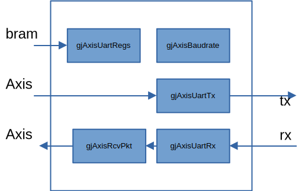

# gjAxisUart

<p align="center">
    <a href="./README-zh.md">中文</a> |
    English
</p>

---

[](https://github.com/kejie1208/gjAxisUart/stargazers)
[](https://github.com/kejie1208/gjAxisUart/blob/main/LICENSE)

a UART with an AXIS interSace。

The basic functionality of each module has been completed and verified through normal simulation, but abnormal conditions have not been simulated yet.

<link rel="stylesheet" type="text/css" href="mkAutoNumber.css" />

## Features

- Configurable baud rate
- Parity check
- Configurable stop bits (1 or 2 bits)
- AXI interface, CPU uses DMA for reception and transmission
- Automatic packet assembly configuration for reception
  - Configure the maximum frame length, submit a frame
  - Submit a frame upon reaching the configured timeout duration

## Architecture



### gjAxisUartRegs
The register module: Due to the small number of registers, stores the registers of each module in this module. 

It records received information.

### gjAxisUartBaudrate
Baud Rate Generation Module: Generates the corresponding clock enable signal based on the baud rate registor configured by the software.

### gjAxisUartTx
Transmission Module: Generates the TX waveform according to the protocol.
### gjAxisUartRx
Reception Module: Receives the RX signal, generates the AXIS signal, and produces error signals in accordance with the protocol.

### gjAxisUartRcvPkt
Packet Assembly: For the received data, packets are assembled based on the configured maximum packet size and maximum inter-frame gap (generating the receive tlast signal).

## Interface


| signal            | IO | discription                              |
|:---------         |:-----     | :----------------------------------- |
| rst               | I  | Synchronous reset with clk                           |
| clk               | I  | the clock                               |
|___________________|___|___________________|
| tx_axis_tvalid    | I  | AXI transmit section                    |
| tx_axis_tready    | O  |                                  |
| tx_axis_tdata[7:0]| I  |                                  |
| tx_axis_tlast     | I  | Used to control the inter-frame gap      |
|___________________|___|___________________|
| rx_axis_tvalid    | O  | AXI receive section                    |
| rx_axis_tdata[7:0]| O  |                                  |
| rx_axis_tlast     | O  |                                  |
|___________________|____|___________________|
| bram_en           | I  | bram interface for configuration                       |
| bram_addr[3:0]    | I  | the same as the Xilinx BRAM interface             |
| bram_we[3:0]      | I  | may connect to Xilinx Axi2bram ip               |
| bram_wdata[31:0]  | I  |                                  |
| bram_rdata[31:0]  | O  | rdata becomes valid one clock cycle after en is active.         |
|___________________|____|___________________|
| tx                | O  | uart tx interface                          |
| txEn              | O  | uart tx enable, for 485        |
| rx                | I  | uart rx interface                          |
|___________________|____|___________________|

no interrupt interface, if necessary, please use DMA interrupts，or：
  - tx int: tx_axis_tvalid& tx_axis_tready & tx_axis_tlast  
  - rx_int: rx_axis_tvalid& rx_axis_tready & rx_axis_tlast 


## Registors

| offset | name     | RW  | discription                              |
|:------ |:-----    |:--- | :----------------------------------- |
| 0x00   |ctrl |RW   |Ctrl for work<br>`[0]work enable`<br>`    1:enable`<br> `    0:disable`<br>`[1] Reset Status Flag，read only`<br>`    1:sleeping`<br> `    0:working`             |
| 0x01   |mode      |RW   | work mode  <br> `    [0] 1:2 stop`<br> `        0:1 stop`<br>`    [1] 1:odd  parity check`<br>  `    [2] 1:even parity check`<br>`    [3]enable tx nop`<br> `        1:enable`<br> `        0:disable`                  |
| 0x02   | clkDivX16  [15:0] |RW | 16x Baud Rate Counting Cycle，clkDivX16=clkHz/16/baudrate            |
| 0x04   | txByte_nop [15:0] |RW | The number of bits to wait after sending 1 byte.                           |
| 0x06   | txFrame_nop[15:0] |RW | The number of bits to wait after sending 1 frame.                           |
| 0x08   | maxRcvGap[15:0] |RW | Maximum number of bits between bytes in a frame, also the minimum number of bits for inter-frame spacing            |
| 0x0c   | maxBytesPerFrame[23:0] |RW | Maximum number of bytes in a frame            |
| 0x10   | txBytes[31:0] |R | Total number of bytes sent            |
| 0x14   | txBytes[31:0] |R | Total number of bytes received            |
| 0x18   | txBytes[31:0] |R | Total number of bytes with receive parity errors            |
| 0x1c   | txBytes[31:0] |R | Total number of receive error enables            |


## Code

Verilog HDL。

### Tools

- [iverilog](https://bleyer.org/icarus/)（for simulation）
- [Vivado](https://www.amd.com/en/products/software/adaptive-socs-and-fpgas/vivado.html)（gen Xilinx FPGA bit）

## Simulation

execute make to run the simulation in the 02_tb directory：
```bash
cd 02_tb
make
```

## run in FPGA board


### build bit


```bash


```

